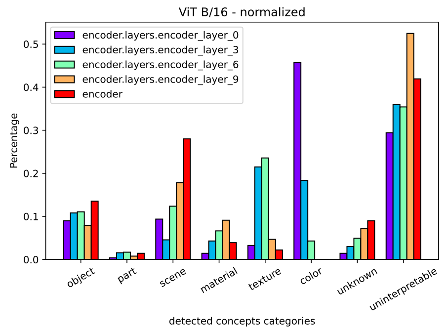

# Profiling-Vision-Neural-Networks-with-CLIP-DISSECT

This is the Codebase for "Profiling Vision Neural Networks with CLIP-DISSECT" report. 

## Installation
1. Install Python (3.10)
2. Install remaining requirements using `pip install -r requirements.txt`

## Quick Start
run `python network_profiling.py`

neuron descriptions from CLIP-DISSECT of ResNet-18/50, and ViT B/16 are provided in this repo.

## How to modify 

1. run with your own subject model: following [CLIP-DISSECT](https://github.com/Trustworthy-ML-Lab/CLIP-dissect) to dissect your own vision model, get neuron explanations. Then, run `python network_profiling.py --neuron_explanation_path [YOUR OWN NEURON EXPLANATIONS PATH] --NN_type [YOUR MODEL NAME] --interpretable_threshold [YOUR UNINTERPRETABLE THRESHOLD] --categories [YOUR CATEGORIES]`

2. replace y axis as neuron counts rather than percentage: `python network_profiling.py --unnormalize`

